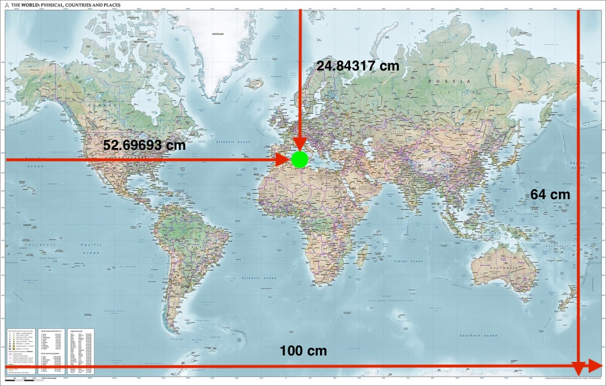
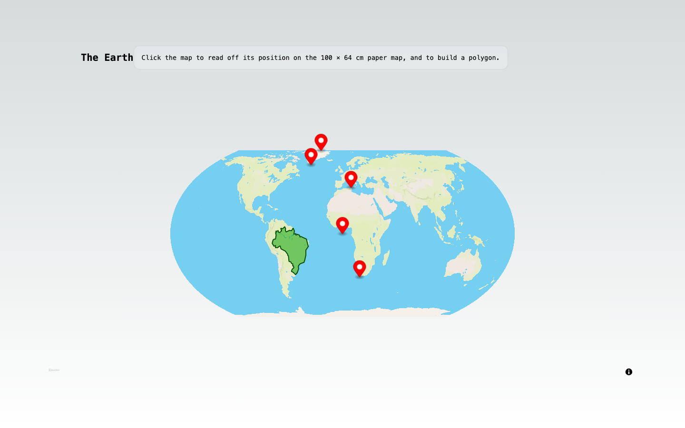
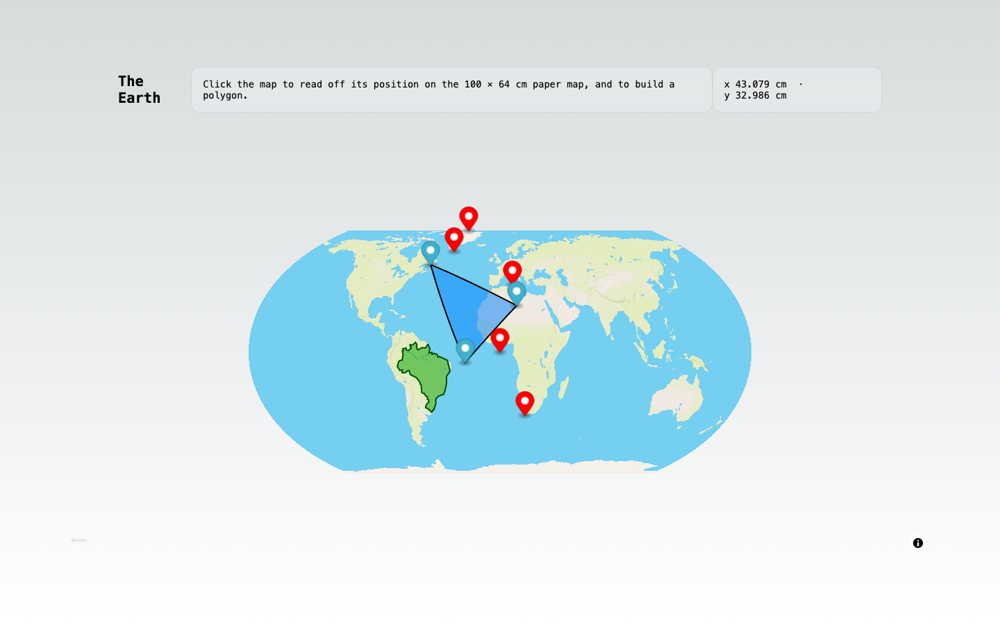
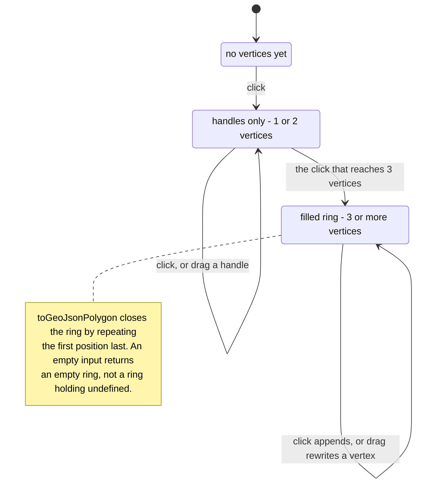
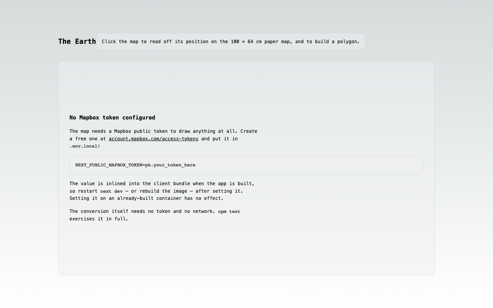

# The Earth — paper map ↔ globe

Take a ruler to a 100 × 64 cm Mercator wall map, read off "52.69693 cm across,
24.84317 cm down", and this tells you that is 9.70895°E, 37.30287°N — the top of
Africa. It plots the answer on an **Equal Earth** globe, where Greenland stops
being bigger than Africa.

It began as a take-home exercise (hence the package name,
`biodock-react-maps-interview`) and has been kept to that scope: better
structure, real tests, honest documentation — not more features.

## What it looks like

The supplied paper map, with the `TopOfAfrica` measurement marked on it:



The same sheet as a globe. Brazil's green outline is **not** loaded from a
geographic dataset — it is 172 centimetre measurements taken off the paper map
(`public/partial-brazil.json`), each one pushed through the conversion. That it
lands on Brazil is the clearest evidence the maths is right. The red pins are
the four measurements the exercise supplies.



Clicking reads the click back off the paper map — the `x` / `y` readout in the
header — and adds a vertex to a polygon you can drag by its corners.



## The conversion

Two functions in `src/domain/conversion.ts`, and nothing else in the project is
as important:

| | |
|---|---|
| longitude | a linear rescale of `x` from `[0, 100] cm` onto `[-180, 180]°` |
| latitude | the **Gudermannian** of `y` rescaled onto `[π, -π]` — `atan(sinh y)` |
| inverse | `atanh(sin φ)`, which is where Mercator's vertical stretch comes from |

The module imports nothing. No React, no Next.js, no Mapbox — plain arithmetic
over `{ x, y }` and `{ lng, lat }` objects, so the whole suite runs offline in
under a second.

Two properties are worth calling out, because both are pinned by name in
`src/domain/conversion.test.ts`:

- **The map edge is 85.0511°, not 90°.** Mercator sends latitude 90° to infinite
  height, so a sheet of finite size has to stop short. `y = 0` yields
  +85.0511287798066°, and *"has no jump at the top and bottom edges"* checks the
  function stays continuous there rather than snapping the top row of paper onto
  the North Pole.
- **The poles clamp instead of diverging.** `inverseGudermannian(±90)` genuinely
  goes to infinity, so the reverse conversion returns the map edge —
  *"clamps to the map edge instead of returning Infinity"*.

The exercise's own point is a test too: *"draws Greenland taller than Africa on
paper"* and *"but Africa spans about three times the latitude"*, the second
asserting the ratio lands between 2.9 and 3.1.

## What a click does

The polygon you draw has three states, and the middle one is the non-obvious
part: one or two clicks draw handles but no shape, because a GeoJSON linear ring
needs three distinct vertices to enclose an area (`MINIMUM_RING_VERTICES` in
`src/domain/polygon.ts`).



Every click, in every state, also runs the reverse conversion and updates the
centimetre readout. Brazil's outline is drawn by the same `LngLatPolygon`
component with `editable` off — a coastline's hundreds of vertices as draggable
pins would be a wall of overlapping markers hiding the shape underneath.

## Running it

```bash
npm install
npm run dev            # http://localhost:4500
```

That works with no configuration at all — the conversion, the API routes and the
entire test suite need neither a token nor a network. **The basemap is the one
part that does.** This repository ships no Mapbox token and none is bundled; you
need your own free [Mapbox public token](https://account.mapbox.com/access-tokens/):

```bash
cp .env.example .env.local     # then put your own pk.… token in it
npm run dev
```

Without one the map area is replaced by a panel explaining exactly that, rather
than a blank rectangle with the reason hidden in the browser console — Mapbox GL
JS v3 refuses to draw anything at all without a valid token:



A Docker setup is included — `cp .env.example .env`, then
`docker compose up --build`. It was not built or booted in this pass (Docker was
unavailable), so treat it as reviewed-by-reading rather than as verified.

## Environment

| Variable | Required | Default | Purpose |
|---|---|---|---|
| `NEXT_PUBLIC_MAPBOX_TOKEN` | No | unset | **Your own** Mapbox public token. Unset means the notice above instead of the basemap; everything else still works. |
| `PORT` | No | `4500` | Port `npm run dev` and `npm start` listen on. |
| `HOST_PORT` | No | `4500` | Host port `docker compose` publishes to. |
| `NEXT_TELEMETRY_DISABLED` | No | `1` | Set by the npm scripts and the Dockerfile. |

`NEXT_PUBLIC_*` values are substituted into the JavaScript bundle when the app is
**built**, not when it starts. Setting the token on an already-built container
does nothing, which is why `docker-compose.yml` passes it as a build argument
rather than an environment variable.

A Mapbox *public* token is designed to be visible in client-side code, so
shipping one in a bundle is not a leak in itself — but it is billed to whoever
owns it. Use your own, and restrict it by URL in the Mapbox dashboard.

## Scripts

```bash
npm run dev          # dev server on $PORT (default 4500)
npm run build        # production build; fails on type errors
npm start            # serve the production build
npm test             # vitest — 32 tests across 4 files
npm run lint         # eslint via next lint
npm run typecheck    # tsc --noEmit
```

`npm test` is offline by design: `test/setup.ts` replaces `fetch` and
`XMLHttpRequest` with stubs that throw, so a test that tried to reach Mapbox for
tiles — which costs real money per request, on someone's account — fails loudly
instead of quietly passing on one machine and not another.

## Where things live

```
src/
  domain/          pure arithmetic and data. No React, no Mapbox, no fs.
    conversion.ts      the two conversions and the Mercator limit
    pointsOfInterest.ts  the four supplied measurements and the published answers
    polygon.ts         coordinates -> a closed GeoJSON ring
  server/          node-only. Reads files, writes responses.
    datasets.ts        the registry of every file the API serves
    serveDataset.ts    resolve, stream, cache, 404
  hooks/useCoastline.ts   fetch centimetre measurements, convert, expose
  components/
    EarthMap.tsx           the map, loaded via next/dynamic
    LngLatPolygon.tsx      a polygon with optional draggable handles
    MissingTokenNotice.tsx what renders when no token is set
  pages/index.tsx   layout, readout state, the token branch
  pages/api/        three dataset routes and a /api/health probe
public/            partial-brazil.json plus the two merged country files
world-geojson/     197 source country outlines and the script that merges them
scripts/           thin_coastline.py — keep one coastline vertex in every N
```

Each `domain/` and `server/` module sits next to its own `*.test.ts`.

## Decisions worth explaining

**Mapbox GL JS is loaded after paint.** It is the bulk of this page's JavaScript
and cannot server-render anyway, since it needs a WebGL context. `EarthMap` is
pulled in with `next/dynamic` and `ssr: false`, which moves it into a chunk the
browser fetches separately. From `next build` in this checkout:

| Route | Size | First Load JS |
|---|---|---|
| `/` | 3.54 kB | 78.5 kB |

**The two country files are cached hard.** `countries_coords.json` and
`countries_physical.json` are ~1.2 MB together and are immutable build outputs,
so `serveDataset` sends `public, max-age=86400, immutable`. The test
*"declares JSON, the exact length, and a cache policy"* pins it.

**One registry instead of a copy of the streaming code per route.** Every
dataset is declared once in `server/datasets.ts`; one tested helper resolves it
from `process.cwd()` and streams it. Resolving from the working directory rather
than `__dirname` matters because a `__dirname`-relative path encodes where the
compiler happened to put the route, which changes under
`output: "standalone"` — *"resolves paths against the given root, not the
compiler's output layout"* is the test for it. Serving another of the 197
country outlines is a registry entry plus a three-line route.

**The coastline fetch aborts on unmount.** `useCoastline` carries an
`AbortController` and surfaces a failed request as an `error` string rather than
silently rendering no outline.

## Known gaps

- **No token-free basemap.** Mapbox GL JS v3 will not render one — not even a
  raster style Mapbox does not host — so "no token" means the notice panel, not
  a degraded map. Everything except the basemap works without a token.
- **The sheet is hardcoded at 100 × 64 cm.** The exercise specifies one map, so
  the dimensions are constants rather than configuration.
- **No component or end-to-end test.** The conversion, the polygon construction
  and the dataset routes are covered by the 32 unit tests. The React components
  are checked by `tsc` and by hand only.
- **`countries_coords.json` and `countries_physical.json` are served whole.**
  Nothing in the UI consumes them yet, and a client that did would want them
  filtered or tiled rather than as one ~600 KB response.
- **The polygon is not persisted.** Reloading the page loses it, and there is no
  undo — clicking only ever appends a vertex.
