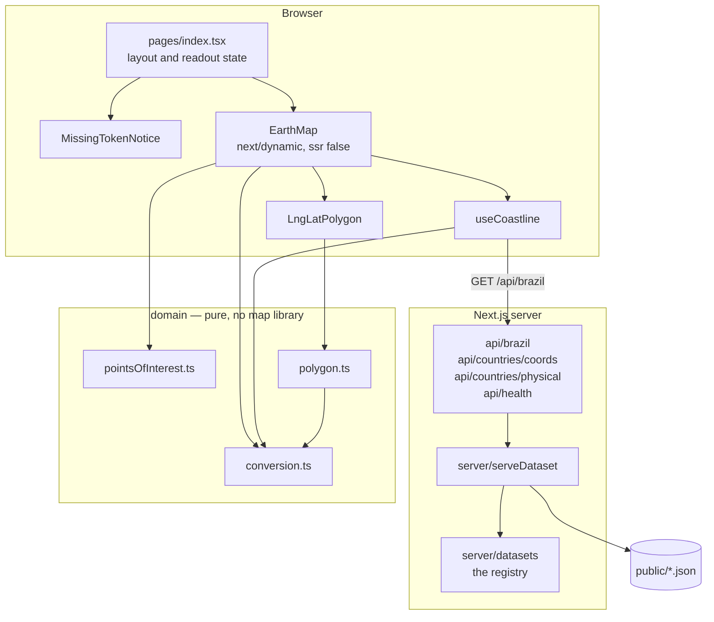
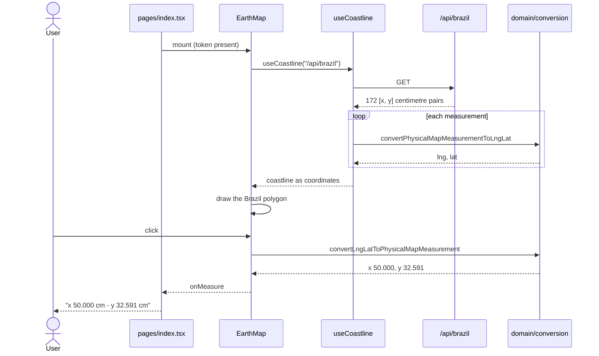

# The Earth — paper map ↔ globe

A 100 × 64 cm Mercator wall map, and a browser globe. This converts a ruler
measurement taken off the paper map ("52.7 cm across, 24.8 cm down") into a real
longitude and latitude, and back again.

It then draws the result on an **Equal Earth** projection, which is the point of
the exercise: Mercator inflates everything near the poles, so on paper Greenland
is *taller* than Africa. On a globe it plainly isn't.

This started life as a take-home interview exercise (hence the package name,
`biodock-react-maps-interview`). It has been kept to that scope — better
structure, real tests and honest documentation, not more features.

## Screenshots

The supplied brief, and where `TopOfAfrica` was measured from:


The same point, converted and plotted. Brazil's outline was **not** loaded from a
geographic dataset — it is 172 centimetre measurements taken off the paper map,
run through the conversion. It lands on Brazil, which is the clearest evidence
the maths is right.


Click anywhere to read off where that point sits on the paper map, and to build a
polygon. Its corner handles can be dragged.


With no Mapbox token configured, the map is replaced by an explanation rather
than a blank rectangle:


## Architecture

The conversion is the part worth protecting, so it sits in a `domain/` layer that
knows nothing about Mapbox, React or Next.js — it is plain arithmetic over plain
objects. Everything else points inward at it.



## The main flow

Loading the coastline, and reading a click back off the paper map. The numbers
below are from an actual run — a click on the horizontal centre of a 1440 px
viewport, which is longitude 0 and therefore exactly 50 cm across the sheet.



## Quickstart

```bash
npm install
npm run dev            # http://localhost:4500
```

The app runs without any configuration — the conversion, the API routes and the
whole test suite need no token and no network. Only the basemap does. For that,
get a free [Mapbox public token](https://account.mapbox.com/access-tokens/):

```bash
echo 'NEXT_PUBLIC_MAPBOX_TOKEN=pk.your_token' > .env.local
npm run dev
```

With Docker:

```bash
cp .env.example .env   # add your token
docker compose up --build
```

## Configuration

| Variable | Required | Default | Purpose |
|---|---|---|---|
| `NEXT_PUBLIC_MAPBOX_TOKEN` | No | empty | Mapbox public token for the basemap. Without it the map is replaced by the notice shown above; everything else still works. **Inlined into the client bundle at build time** — see the note below. |
| `PORT` | No | `4500` | Port `npm run dev` and `npm run start` listen on. |
| `HOST_PORT` | No | `4500` | Host port `docker compose` publishes to. |
| `NEXT_TELEMETRY_DISABLED` | No | `1` | Set by the npm scripts and the Dockerfile; Next.js telemetry stays off. |

`NEXT_PUBLIC_*` variables are substituted into the JavaScript bundle when the app
is **built**, not when it starts. Setting the token on an already-built container
does nothing, which is why `docker-compose.yml` passes it as a build argument
rather than an environment variable.

A Mapbox *public* token (`pk.…`) is designed to be visible in client-side code —
that is not a leak in itself — but it is billed to whoever owns it, so use your
own and restrict it by URL in the Mapbox dashboard.

## Development

```bash
npm run dev          # dev server on $PORT (default 4500)
npm run build        # production build; fails on type errors
npm start            # serve the production build
npm test             # vitest, 32 tests
npm run test:watch   # vitest in watch mode
npm run lint         # eslint via next lint
npm run typecheck    # tsc --noEmit
```

`npm test` is offline by design. `test/setup.ts` replaces `fetch` and
`XMLHttpRequest` with stubs that throw, so a test that tried to reach Mapbox for
tiles — which costs money per request — fails loudly instead of quietly working
on one machine and not another.

## Project structure

```
src/
  domain/                  pure arithmetic and data. No React, no Mapbox, no fs.
    conversion.ts            the two conversions, and the Mercator limit
    conversion.test.ts
    pointsOfInterest.ts      the four supplied measurements and their answer key
    pointsOfInterest.test.ts
    polygon.ts               coordinates -> a closed GeoJSON ring
    polygon.test.ts
  server/                  node-only. Reads files, writes responses.
    datasets.ts              the registry of every file the API serves
    serveDataset.ts          resolve, stream, cache, 404
    serveDataset.test.ts
  hooks/
    useCoastline.ts          fetch centimetre measurements, convert, expose
  components/
    EarthMap.tsx             the map, loaded via next/dynamic
    LngLatPolygon.tsx        a polygon with optional draggable handles
    MissingTokenNotice.tsx   what renders instead when no token is set
  pages/
    index.tsx                layout, readout state, token branch
    api/                     three dataset routes and a health probe
  styles/
public/
  partial-brazil.json        Brazil's coastline, in cm on the paper map
  countries_coords.json      every country outline, in lng/lat
  countries_physical.json    every country outline, in cm on the paper map
  map.jpg, map-measurement.jpg   the supplied paper map, and the brief's diagram
world-geojson/
  countries/                 197 source outlines
  get_all_polygons.py        merges them into the two countries_*.json above
scripts/
  thin_coastline.py          keep one coastline vertex in every N
test/
  setup.ts                   the no-network guard
docs/                        screenshots
```

## Design notes

**The domain layer owns no dependencies.** `conversion.ts` used to import
`LngLat` from `mapbox-gl` and return instances of it, which pointed the most
valuable module in the project at the heaviest one. It now returns a plain
`{ lng, lat }`, which a real Mapbox `LngLat` is structurally compatible with, so
callers are unaffected. The practical effect: the conversion test stopped pulling
a 400 KB WebGL library into its import graph and got about four times faster
(933 ms to 218 ms on the same machine).

**Why the map stops at 85.05°.** Mercator never reaches the poles — the
projection sends latitude 90° to infinite height, so a sheet of any finite size
has to stop short, at ±85.0511° for one shaped like this. The original code
special-cased the top and bottom rows to return ±90°, which put a 4.95° cliff
into an otherwise smooth function and claimed the top edge of the paper was the
North Pole. That case is gone. The *inverse* still guards, but for a real reason:
asking where latitude 90° sits on the sheet has no answer, because the maths
genuinely diverges, so it clamps to the map edge instead of returning `Infinity`.

**The real bottleneck was the bundle, not the server.** There is no database and
no meaningful per-request work — the API routes stream three static files. What
was expensive was the first page load: Mapbox GL JS was compiled into the page
chunk, and it cannot server-render anyway because it needs a WebGL context.
Loading `EarthMap` through `next/dynamic` with `ssr: false` moves it into a chunk
the browser fetches after paint. Measured from `next build`:

| | Page JS | First Load JS |
|---|---|---|
| before | 416 kB | 490 kB |
| after | 3.54 kB | 78.5 kB |

The second saving is caching. The two country files are 618 KB and 593 KB, and
they were served with no `Cache-Control` header at all, so a browser re-fetched
1.2 MB on every load. They are immutable build outputs, so they are now served
`public, max-age=86400, immutable`.

**One registry, not three copies of the same route.** Each API route used to
inline its own `fs.createReadStream`, and two of them located their file with
`path.join(__dirname, "../../../../../public/…")` — five parent segments that
encode where webpack happens to put the compiled route rather than anything about
the project. It resolves under a default `next build` and breaks under
`output: "standalone"`. Every dataset is now declared once in
`server/datasets.ts` and served by one tested helper that resolves from
`process.cwd()`. Serving another of the 197 country outlines is a registry entry
and a three-line route; that is the seam this project actually needs.

**Tests that can fail.** A suite that only ever goes green proves nothing, so
each of these was broken on purpose and the suite re-run:

| Mutation | Result |
|---|---|
| reinstate the ±90 pole special case | 2 failed, 30 passed |
| remove the pole clamp, so the inverse returns `Infinity` | 1 failed, 31 passed |
| transpose lng/lat in the GeoJSON ring | 1 failed, 31 passed |
| close the ring without guarding the empty case | 1 failed, 31 passed |
| wrong sheet height (100 cm instead of 64) | 5 failed, 27 passed |
| drop the cache policy on served datasets | 1 failed, 31 passed |
| swallow the missing-dataset error instead of 404 | 1 failed, 31 passed |

All seven were caught, and the suite returns to `32 passed (32)` once reverted.

**Graceful degradation.** Mapbox GL JS v3 refuses to draw anything without a
valid token — not even a raster basemap Mapbox does not host, which was verified
directly. So "no token" previously meant a blank white page with the reason
visible only in the browser console. The page now branches on the token and
renders an explanation instead.

## Limitations

- **The basemap needs a Mapbox account.** There is no token-free fallback
  basemap, because Mapbox GL JS will not render one. Everything except the
  basemap works without a token.
- **The paper map is hardcoded at 100 × 64 cm.** The exercise specifies one
  sheet, so the dimensions are constants rather than configuration.
- **`world-geojson/all_polygons.json` and `all_coord_polygons.json` are still
  tracked** despite being byte-identical to the copies in `public/` and listed in
  `.gitignore`. `.gitignore` does not untrack a file that is already committed;
  clearing them needs `git rm --cached` and a commit, which has not been done
  here. That is 1.2 MB of duplication in the repository.
- **The Mapbox token that was hardcoded in the original source is still present
  in the git history.** It was removed from the working tree, but removing a
  secret from the tip of a branch does not remove it from earlier commits. It
  belonged to the exercise author, not to this repository; it should be revoked
  at the Mapbox dashboard, and the history rewritten, before this is made public.
- **No end-to-end test of the map itself.** The conversion, the polygon
  construction and the dataset routes are covered; the React components are
  verified by type-checking and by hand, not by a component test suite.
- **`countries_coords.json` and `countries_physical.json` are served whole.**
  Nothing in the UI consumes them yet, and a client that did would want them
  filtered or tiled rather than as a single 600 KB response.
